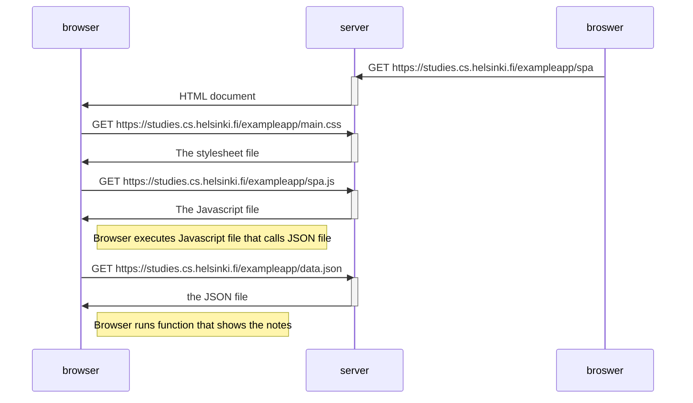

```mermaid
sequenceDiagram
    participant browser
    participant server

    broswer->>server: GET https://studies.cs.helsinki.fi/exampleapp/spa
    activate server
    server->>browser: HTML document
    deactivate server

    browser->>server: GET https://studies.cs.helsinki.fi/exampleapp/main.css
    activate server
    server->>browser: The stylesheet file
    deactivate server

    browser->>server: GET https://studies.cs.helsinki.fi/exampleapp/spa.js
    activate server
    server->>browser: The Javascript file
    deactivate server

    Note right of browser: Browser executes Javascript file that calls JSON file

    browser->>server: GET https://studies.cs.helsinki.fi/exampleapp/data.json
    activate server
    server->>browser: the JSON file
    deactivate server

    Note right of browser: Browser runs function that shows the notes
    
```
