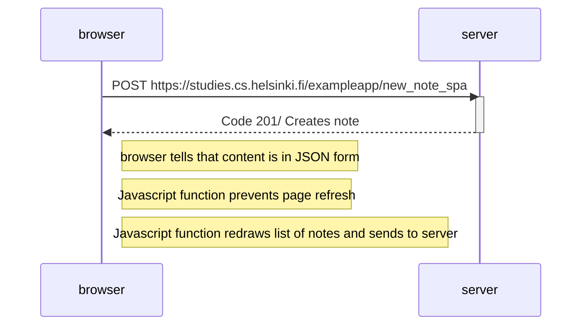

```mermaid
sequenceDiagram
    participant browser
    participant server

    browser->>server: POST https://studies.cs.helsinki.fi/exampleapp/new_note_spa
    activate server
    server-->>browser: Code 201/ Creates note
    deactivate server

    Note right of browser: browser tells that content is in JSON form

    Note right of browser: Javascript function prevents page refresh
    Note right of browser: Javascript function redraws list of notes and sends to server
```
